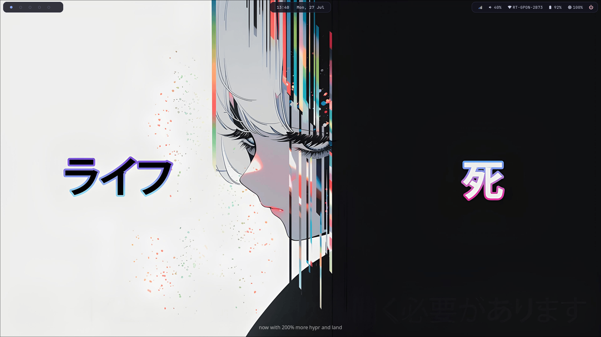

<div align="center">

# concept-dots

**A minimal, muted-tone Hyprland setup for CachyOS**

_fish · waybar · rofi · kitty · hyprlock_


</div>

---

## Preview



## ✨ What's inside

| Component     | Tool                             |
| ------------- | -------------------------------- |
| Compositor    | [Hyprland](https://hyprland.org) |
| Bar           | Waybar                           |
| Launcher      | Rofi (wayland fork)              |
| Terminal      | Kitty                            |
| Shell         | fish + starship prompt           |
| Lockscreen    | hyprlock + hypridle              |
| Notifications | dunst                            |
| Logout menu   | wlogout                          |
| Wallpaper     | hyprpaper                        |
| Fetch splash  | fastfetch                        |

Color palette is a custom low-saturation dark theme called **concept** — muted lavender/rosewater accents on a near-black base, kept consistent across every app (see `.config/hypr/colors.conf`).

## 📦 Requirements

- A fresh **CachyOS** (or any Arch-based distro) install
- An internet connection (the installer builds `paru` if it's missing)
- Not running as root

## 🚀 Install

```bash
git clone https://github.com/kavoshnik/concept-dots.git
cd concept-dots
./install.sh
```

The script will:

1. Install `paru` (AUR helper) if it isn't already present
2. Install all required packages via `pacman` + `paru`
3. Back up your existing `~/.config` entries to `~/.config-backup-<timestamp>`
4. Symlink this repo's configs into `~/.config`
5. Install Fisher + fish plugins
6. Offer to set `fish` as your default shell

After it finishes: **reboot or re-login**, then pick Hyprland at your display/login manager.

## ⚙️ Post-install

- Edit `~/.config/hypr/monitors.conf` for your actual monitor layout (`hyprctl monitors` to check names)
- Drop a wallpaper at `~/.config/hypr/wallpapers/default.png`
- Keybinds live in `~/.config/hypr/keybinds.conf` — default mod key is `SUPER`

### Key defaults

| Keys                | Action              |
| ------------------- | ------------------- |
| `SUPER + Return`    | Terminal (kitty)    |
| `SUPER + Space`     | App launcher (rofi) |
| `SUPER + Q`         | Close window        |
| `SUPER + E`         | File manager        |
| `SUPER + L`         | Lock screen         |
| `SUPER + ESC`       | Logout menu         |
| `SUPER + SHIFT + S` | Screenshot (region) |
| `SUPER + 1-0`       | Switch workspace    |

## 🎁 Optional extras

`install.sh` will ask at the end whether you want these — both can also be run standalone any time:

```bash
./scripts/install-sddm-theme.sh silvia   # SilentSDDM login theme, "silvia" preset
./scripts/install-grub-theme.sh          # Elegant GRUB2 bootloader theme
```

- **[SilentSDDM](https://github.com/uiriansan/SilentSDDM)** — a polished SDDM login theme. Other bundled presets: `default`, `rei`, `ken`, `everforest`, `catppuccin-latte/frappe/macchiato/mocha`, `nord`.
- **[Elegant-grub2-themes](https://github.com/vinceliuice/Elegant-grub2-themes)** — a GRUB bootloader theme. Skipped automatically if your system doesn't use GRUB (e.g. systemd-boot). Default install is `forest / window / left / dark / 1080p` — edit the flags inside the script for other variants.

## 🗂️ Structure

```
concept-dots/
├── install.sh
├── .config/
│   ├── hypr/           # hyprland.conf, keybinds, rules, colors, lock/idle
│   ├── waybar/          # config.jsonc + style.css
│   ├── rofi/            # config.rasi + theme.rasi
│   ├── kitty/
│   ├── fish/             # config.fish + functions/ + fish_plugins
│   ├── starship.toml
│   ├── dunst/
│   ├── wlogout/
│   └── fastfetch/
├── scripts/
│   ├── install-sddm-theme.sh
│   └── install-grub-theme.sh
├── wallpapers/
└── assets/               # screenshots for this README
```

## 🎨 Customizing the palette

All colors live in one place per app:

- Hyprland: `.config/hypr/colors.conf`
- Waybar: top of `.config/waybar/style.css`
- Rofi: top of `.config/rofi/theme.rasi`
- Kitty: `.config/kitty/kitty.conf`

Change the hex values there and everything stays consistent.

## 📄 License

MIT — do whatever you want with it.
